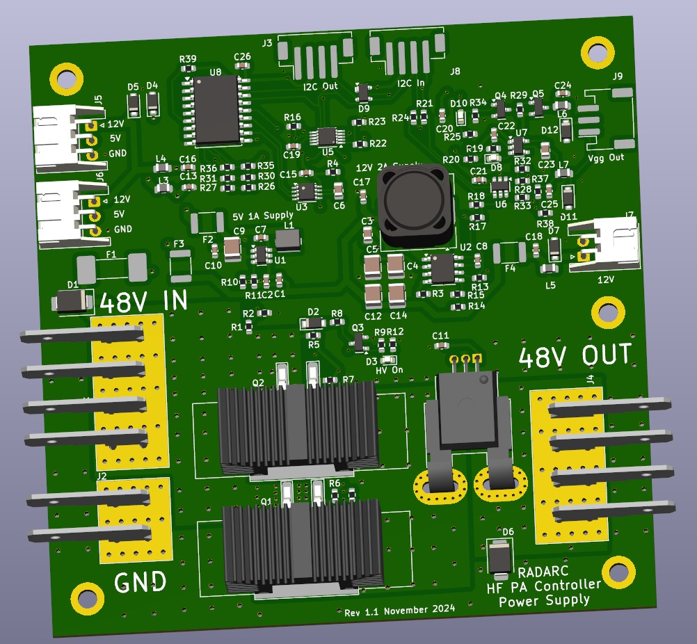

# Modular-PA-Controller
Controller for High Power RF Power Amplifiers based Raspberry Pi Pico

Reading and District Amateur Radio Club(RADARC) are working together on a number of collaborative construction projects. This one is to design and build a Modular PA controller for High Power (1kW plus) semiconductor Power amplifiers.
This prototype implementation is targetted on the High Power HF PA Modules from [W6PQL](https://www.w6pql.com/) :

* [Kilowatt PA](https://www.w6pql.com/1_kw_sspa_for_1_8-54_mhz.htm)
* [LPF Filter](https://www.w6pql.com/a_1.5kw_lpf_for_160-6m.htm)
* [Directional Coupler](https://www.w6pql.com/1_8_to_54_mhz_dual_coupler.htm)

## Objectives:
<ul>
<li><strong>Protection</strong></li>
<ul>
<li>Protection of user and premises</li>
<li>Protection of Power Amplifier</li>
<li>Protection of connected equipment</li>
</ul>
<li><strong>Automatic Operation and Sequencing</strong>
<ul>
<li>Monitoring of Power Amplifier operational state</li>
<li>Control of operational components of Power Amplifier</li>
<li>Detection of state of connected equipment</li>
<li>Sequencing and crystal controlled timing of sequencing</li>
</ul>
<li><strong>Power Supplies</strong></li>
<ul>
<li>Low voltage power supplies derived from High Voltage PA supply</li>
<li>Variable Vgg Bias voltage supply</li>
</ul>
<li><strong> External control and Monitoring</strong></li>
<ul>
<li>LCD Display</li>
<li>USB</li>
<li>TTL Serial</li>
<li>Wifi and Bluetooth</li>

</ul>
</ul>

## Specification
<ul>
<li>Processor: Raspberry Pi Pico</li>
<li>Maximum input Voltage: 72V DC</li>
<li>Maximum switched PA current: 50A</li>
<li>Vgg bias output range: 1.4V to 4.7V</li>
<li>Number of PWM and RPM monitored fans(5V or 12V): 3</li>
<li>Number of voltage controlled fans: 1</li>
<li>Number of directional coupler inputs: 3</li>
<li>Analogue meter outputs: 2
<li>Transceiver ALC output: -12V to +12V</li>
<li>Transceiver digital SEND in/out Ports: 1</li>
<li>OLED control ports: 1</li>
<li>Rotary Encoders: 2</li>
<li>OLED control ports: 1</li>
<li>Input frequency measurement range: 100kHz to 50MHz</li>
<li>Input Power detection: 10dBm to 50dBm</li>
<li>Maximum input Power Tx/RX switching: 50dBm</li>
<li>Output TX/RX relay drivers(5V or 12V): 2</li>
<li>Output LPF relay drivers(%V or 12V): 6</li>
<li>I2C ports: 1</li>
<li>TTLserial ports: 1</li>                                                                                               
</ul>

## Hardware Implementation

The Modular PA Controller Is built around four PCB assemblies:

### Power Supply and Control Board
This board manages the high DC voltage (up to 72V) part of the PA controller. It provides switching of the DC supply up to 50A, also current monitoring and Voltage monitoring. The DC supply switching uses a watchdog an requires the processor to signal the switch every 500uS to keep the power on.
It derives two lower voltage power supplies at 12V 2A and 5V 1A. The 3.3V logic supply for th PA controller is provided by the regulator on the Pi Pico on the processor board.To control the Vgg Bias to the Power Amplifier Modules the board provides either a switched 12V supply to a regulator on the Power Amplifier Board, and also a variable voltage software controlled DC output.
All control and monitoring is via I2C control from the Processor Board.

[Kicad Files](./Kicad/PA_Power_V1/)

### Processor and Interface Board
This board contains the Raspberry Pi Pico microcontroller module. The module alo provides the 3.3V logic supply and the USB interface. Pi Pico modules with Bluetooth and Wi-fi may be used, also the higher performance RP2350 version.

[Pi Pico Data sheet](https://datasheets.raspberrypi.com/pico/pico-datasheet.pdf)

The board has two I2C buses. The internal bus connects to the on board ADC and DAC devices. The external I2C bus connects to the Power Supply and Control board(s), the Relay Driver board(s), LM75 temperature sensors, I2C OLED display, etc.

The board has an input TX/RX relay to bypass the Power Amplifier Modules as required.

### Relay Driver Board

### RF screen

## Software Implementation